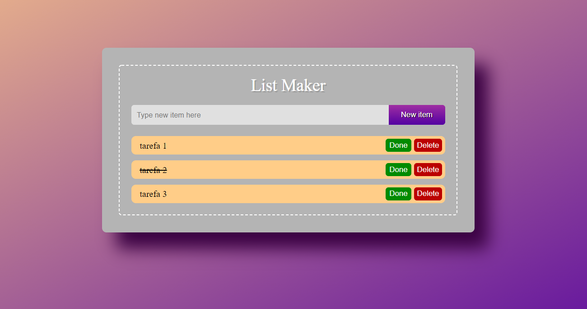

# ListMaker 📃
Aplicação para criar listas em localStorage, com botões para deletar e marcar itens como concluídos.
Para acessar-lo, <a href="https://raphael-ramalho.github.io/ListMaker/">clique aqui</a>.

## 🛠️ Construído com
<ul>
 <li>Javascript
 <li>HTML5
 <li>CSS3
</ul>

## 📗 Principais conceitos colocados em prática:
<ul>
 <li>localStorage
 <li>Manipulação de Array
 <li>DOM
</ul>
 
⌨️ com 💜 por Raphael Ramalho 😃
